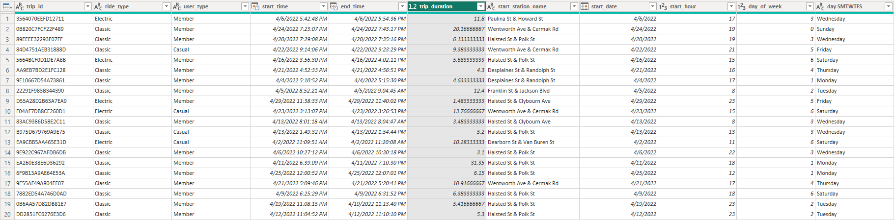
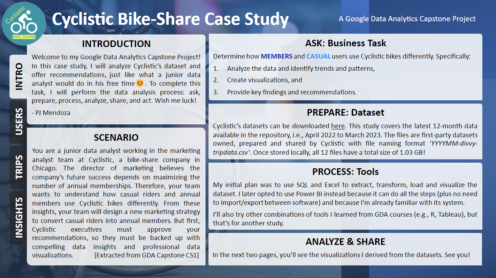
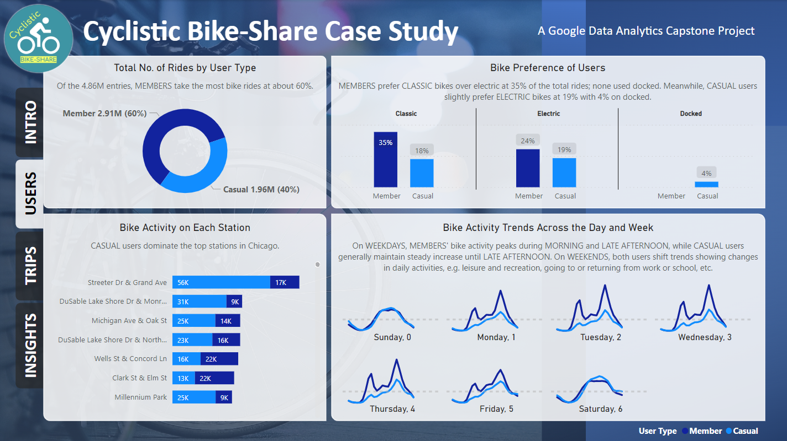
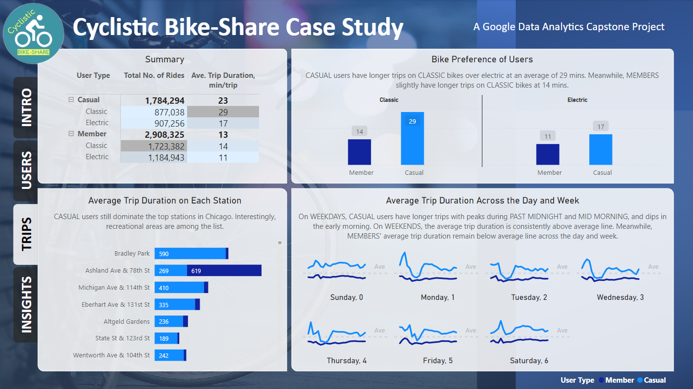
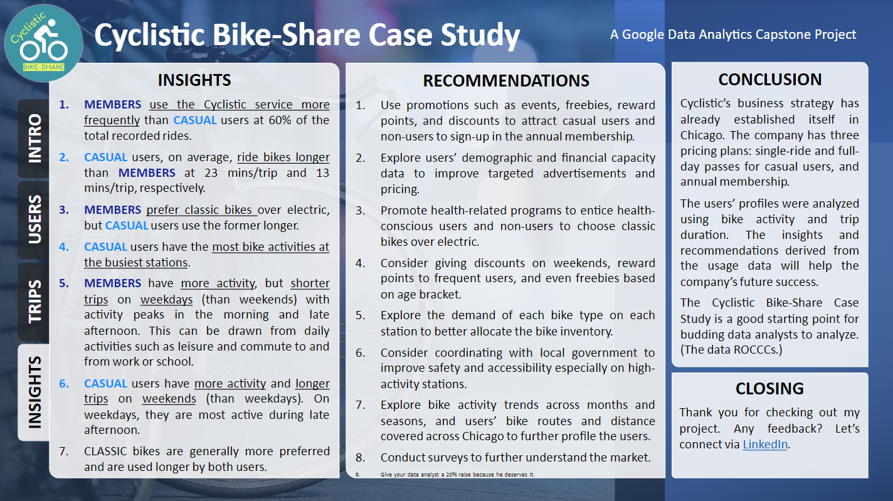

# Cyclistic, Inc. Bike-Share Case Study

## Foreword from the Data Analyst

Welcome to my **Google Data Analytics Professional Certificate Capstone Project**! In this case study, we will analyze Cyclistic, Inc.’s dataset and offer recommendations, just like what a junior data analyst would do in his free time😊. To complete this task, we will perform the data analysis process: ask, prepare, process, analyze, share, and act. We will use the power of **Power BI** to complete this challenge.

Check out the course at [Coursera](https://www.coursera.org/professional-certificates/google-data-analytics) to know more.

Let's do this!

## Background

### The Scenario

You are a junior data analyst on the marketing analytics team at **Cyclistic, Inc.**, a fictional bike-share company based in Chicago. Your team received an email from the Director of Marketing herself. She emphasizes that increasing the number of annual memberships is crucial for the company’s future growth. To achieve this, your team aims to analyze the differences in how casual riders and annual members use Cyclistic bikes. These insights will inform the development of a marketing strategy to encourage casual riders to subscribe to annual membership. However, before implementing your team's recommendations, Cyclistic executives need to approve them, so your analysis must be supported by persuasive data insights and professional-quality visualizations.

### About Cyclistic, Inc.

In 2016, Cyclistic, Inc. introduced a successful bike-share program that has since expanded to a fleet of 5,824 geotracked bicycles and 692 stations across Chicago. Riders can unlock bikes from one station and return them to any other station within the system, offering flexibility and convenience.

Up to now, Cyclistic’s marketing efforts have focused on building brand awareness and appealing to a broad audience. A key factor in this success has been the flexibility of its pricing options: single-ride passes, full-day passes, and annual memberships. Customers using single-ride or full-day passes are categorized as casual riders, while those with annual memberships are considered Cyclistic members.

Cyclistic’s financial analysts have determined that annual members generate significantly higher profitability compared to casual riders. While pricing flexibility has been effective in attracting customers, the Director of Marketing believes that increasing the number of annual memberships is essential for the company’s future growth. Rather than targeting entirely new customers, She sees an opportunity to convert casual riders into members. Casual riders are already familiar with the Cyclistic brand and rely on it for their mobility needs.

To achieve this, the Director has set a clear objective: develop marketing strategies aimed at converting casual riders into annual members. To inform these strategies, the marketing analytics team needs to explore the differences between annual members and casual riders, understand what might motivate casual riders to purchase memberships, and consider how digital media could enhance their campaigns. The Director and her team plan to analyze Cyclistic’s historical bike trip data to uncover meaningful trends and insights.

Three questions will guide the future marketing program:

1. How do annual members and casual riders use Cyclistic bikes differently?

2. Why would casual riders buy Cyclistic Annual Memberships?

3. How can Cyclistic, Inc. use digital media to influence casual riders to become members?

## Ask: State the Business Task

Determine how **MEMBERS** and **CASUAL** users use Cyclistic bikes differently. Specifically:

1. Analyze the data and identify trends and patterns,

2. Create visualizations, and

3. Provide key findings and recommendations. 

Now, let's ask the *SMART* questions.

**Specific**. Which bike type is the most preferred by MEMBERS and CASUAL users?

**Measurable**. What percentage of the total rides is made by the MEMBERS?

**Action-oriented**. How can we convince the CASUAL users to join the annual membership?

**Relevant**. What programs can we launch to attract more users to ride bikes?

**Time-bound**. What trends can we observe from different short-term time periods?

## Prepare: Do the Datasets ROCCC?

Cyclistic, Inc.’s datasets are downloadable from this [repository](https://divvy-tripdata.s3.amazonaws.com/index.html). This case study covers the 12-month data available at the time of analysis, i.e. April 2022 to March 2023. The files are first-party datasets owned, prepared and shared by Cyclistic, Inc. with file naming format ‘YYYYMM-divvy-tripdata.csv’. Once stored locally, all 12 files have a total size of 1.03 GB!

Let's be reminded that Cyclistic, Inc. is a fictional company that represents a real-world organization. Its datasets are prepared to maintain anonymity. The data has been made available by Motivate International Inc. under this [license](https://ride.divvybikes.com/data-license-agreement).

### STEP 1: Download and Store the Datasets

1. Download 12 zip files from the repository

2. Extract the comma-separated values (CSV) files

3. Save all 12 CSV files in a folder preferably without any irrelevant files

4. Rename the CSV files to YYYYMM-divvy-tripdata.csv format for consistency

Before we analyze the datasets, we should ask ourselves this first: "Does this data *ROCCC*?" 

**Reliable**. Data is accurate, complete and unbiased. 

**Original**. The datasets are first-party data owned, prepared and shared by Cyclistic.

**Comprehensive**. Per case study guide, "... the datasets are appropriate and will enable to answer the business questions."

**Current**. The repository is regularly updated to maintain relevance.

**Cited**. The data has been made available by Motivate International Inc. under this license.

The answer is **YES** so we can be sure that our datasets are unbiased and are credible. 

And by that, we can now proceed with the next phase.

## Process: Clean and Manipulate the Data

My initial plan was to use SQL and Excel to extract, transform, load and visualize the datasets. I later opted to use Power BI instead because it can do all the steps (plus no need to import/export between softwares) and because I’m already proficient with it (at this point, Tableau is a no-go for me. Sorry).

I’ll try other combinations of tools I learned from the GDA course like SQL, Excel, R and Tableau, but that’s for another project.

We start cleaning the data by merging the datasets into a single table (as part of data wrangling). Since all 12 datasets have consistent columns, this will be easy to execute.

### STEP 2: Load Data in Power Query Editor (PQE)

1. Open Power BI, then open the PQE by clicking the "*Transform data*" in the Home tab

2. In the PQE, click "*New Source*" > click "*More*" > "All" tab > click "*Folder*" 

3. Locate the CSV files you saved in STEP 1.3 and copy the directory

4. Go back to PQE and paste the directory in the "Folder path" field > hit "*OK*"

5. Check if all 12 CSV files are loaded then hit "*Combine & Transform Data*"

6. "Combine Files" window will appear > hit "*OK*"

7. All your data will now be loaded in the Power Query Editor.

8. Explore your data. Draw early insights. Think about what to keep and focus on. Also check the data types.

### STEP 3: Transform Data in Power Query Editor

1. Remove the columns

       Source.Name, start_station_id, end_station_id, end_station_name, start_lat, start_lng, end_lat,  end_lng

2. Rename the columns

       rideable_type > ride_type
       started_at > start_time
       ended_at > end_time
       member_casual > user_type

3. Replace values on each column

       Column ride_type: right click column header > click "Replace Values..." > 

              electric_bike > Electric
              classic_bike > Classic
              docked_type > Docked

       Column user_type: right click column header > click "Transform" > click "Capitalize Each Word"

4. Check each column's datatype

### STEP 4: Clean Data in Power Query Editor

1. Check each column for inconsistencies (impossible values, wrong spelling, errors, etc.) and nulls

2. Add custom columns

       trip_duration: "Add Column" tab > hit "Custom Column" > type in the formula "[end_time]-[start_time]" > right click column header > click "Transform" > click "Total Minutes"

       start_date: right click start_time column header > click "Duplicate Column" > find the duplicate > click "Transform" > click "Date Only"

       start_hour: follow the previous step > click "Transform" > click "Hour" > hit "Hour"

       day_of_week: follow the previous step > click "Transform" > click "Day" > hit "Day of Week"

       day_SMTWTFS: follow the previous step > click "Transform" > click "Day" > hit "Name of Day"

3. Filter out outliers

       Trip duration that are negative and less than 1 minute are physically impossible

4. Filter out empty observations/rows

       Some start station rows are empty probably because the GPS did not work

We removed several columns in STEP 3.1 because I opted not to explore the geographical data at the moment. In Power BI, the latitude and longitude must be in decimal number format.

Once we're satisfied with cleaning and manipulating, we hit "*Close and Apply*" and we return to Power BI for data analysis.

### BEFORE

### AFTER

## Analyze: Find Insights, Trends and Patterns

We go back to our business task: Determine how **MEMBERS** and **CASUAL** users use Cyclistic bikes differently. Let's also use the SMART questions we formulated earlier as our guide.

### STEP 5: Analyze using Power BI

These are our plans in analyzing the data:

1. Use count of *trip_id* to get the total number of trips, which we'll later refer to as "Bike Activity"

2. Use the average of *trip_duration* (instead of sum) to further differentiate the *user_type*

3. Use *ride_type* or *user_type* as legends

4. Use pie, bar and line charts (just the simple charts) since these are more preferred by the Executives, our stakeholders

5. Use pie chart to find the value and percentage composition of each *user_type*

6. Use bar chart to further split *user_type* by *ride_type*

7. Use bar chart and sort it in descending order to identify the top *start_station_name*

8. Use line chart to get the daily and weekly trends

9. Use shades of blue to differentiate *user_type* because I like blue

The good thing about Power BI is that analysis and visualization go simultaneously. Cards visual can be used to instantly determine the Bike Activity and Average Trip Duration. You can use the Matrix visual to simulate a pivot table, which can be formatted into a heatmap.

Sharing my struggles, I also have other plans that I scrapped along the way because they're difficult to execute. For example, I tried plotting the start and end stations to visualize the routes majority of the users took, but I'm limited by what I currently know. I also drafted a heatmap for daily and weekly trends which ended up looking like a pretty abstract art, but it did not show what I intend to emphasize.

After discovering several insights and trends, let's make visualizations to impress our boss and the Executives!

## Share: Create the Story

We use the *10-second rule* to assess if our visualizations are effective in communicating the message. As we mentioned in STEP 5.4, we'll just use simple charts like pies, bars and lines. Subtitles are also included to give our insights. 

I used MS PowerPoint to create appealing underlays complete with the company logo, headers, white boxes, side tabs and background. Pretty neat, huh?

Check out these screenshots from my Power BI output. 

### Introduction

### User Profile

### User Trips

## Act: Give Actionable Insights & Recommendations

Finally, we end our case study by sharing our insights and recommendations. Our statements must be clear, concise and consistent.

Check out this screenshot from my Power BI output.

### Insights, Recommendations, and Conclusions

## Closing Remarks

And by that we finally finished our very first case study! It took me a week to finalize the Power BI output and setup an online portfolio. 

I learned so much in this course! Completing this capstone project allowed me to not only hone my DA skills, but also showcase my hardwork. The contents, and its delivery, might not be as polished and as optimized as I envision it to be, but I hope I gave a satisfactory output at the very least.

The [Google Data Analytics Professional Certificate](https://www.coursera.org/professional-certificates/google-data-analytics) course at Coursera is my entry point in the world of data analytics. There is so much more to learn and explore!

To anyone reading this, thank you. I hope you also learned a thing or two from this material.

## About the Data Analyst

Paul Mendoza is a career shifter from the Power industry. He aspires to become a data professional in the hopes of fulfilling his dream of setting up a glorious PC with wide monitors. 

As someone has said, "data is the new oil." But just like crude oil, we should apply the distillation process to obtain quality information ready to combust!
